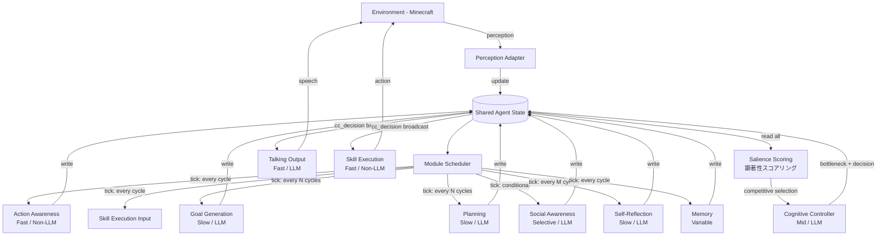

# 01. システムアーキテクチャ設計 - PIANO再現実装

## サマリー

本ドキュメントは、Project Sid論文で提案されたPIANO（Parallel Information Aggregation via Neural Orchestration）アーキテクチャの再現実装に向けたシステムアーキテクチャ設計を記述する。PIANOの核心である「並行性」と「一貫性」の2つの課題を解決するために、共有エージェント状態を中心とした並列モジュール実行基盤と、認知コントローラ（CC）によるGlobal Workspace型のボトルネック+ブロードキャスト制御を設計する。

**技術選定**: Python 3.12+ / asyncio を主軸に、Redis を共有状態ストアとして採用し、Ray による分散実行でスケーラビリティを確保する。

**対応論文セクション**: Section 2 (PIANOアーキテクチャ)、Section 3 (単一エージェント)、Section 6 (研究手法)

---

## 目次

1. [全体アーキテクチャ設計](#1-全体アーキテクチャ設計)
2. [共有エージェント状態の設計](#2-共有エージェント状態の設計)
3. [モジュール間通信](#3-モジュール間通信)
4. [技術選定](#4-技術選定)
5. [スケーラビリティ考慮](#5-スケーラビリティ考慮)
6. [障害復旧・チェックポイント設計](#6-障害復旧チェックポイント設計)
7. [不明点・追加調査事項](#7-不明点追加調査事項)

---

## 1. 全体アーキテクチャ設計

### 1.1 設計原則

PIANOの再現実装では、以下の設計原則に従う（論文Section 2.1-2.2に基づく）:

| 原則 | 論文での根拠 | 実装上の意味 |
|---|---|---|
| **並行性 (Concurrency)** | 高速反射モジュールと低速熟慮モジュールが異なる速度で並列実行 | 各モジュールを独立したasyncタスク/プロセスとして実行 |
| **一貫性 (Coherence)** | CCが情報ボトルネック+ブロードキャストで制御 | CCを中央調整者とし、出力モジュールへの一斉配信機構を実装 |
| **ステートレスモジュール** | 各モジュールは共有Agent Stateに対して読み書き | モジュールは内部状態を持たず、共有状態のみで通信 |
| **プラグイン性** | モジュールの追加・削除・修正が容易 | 統一インターフェースによるモジュール登録・管理 |
| **神経科学的着想** | Global Workspace Theory との対応 | ボトルネック→ブロードキャストの情報フローを忠実に再現 |

### 1.2 全体構成図

```
┌─────────────────────────────────────────────────────────────────┐
│                    PIANO Agent Runtime                          │
│                                                                 │
│  ┌──────────────────────────────────────────────────────────┐   │
│  │              Environment Interface Layer                  │   │
│  │  ┌─────────────┐  ┌──────────────┐  ┌───────────────┐   │   │
│  │  │  Perception  │  │  Action Exec │  │  Chat Handler │   │   │
│  │  │  Adapter     │  │  Adapter     │  │  Adapter      │   │   │
│  │  └──────┬───────┘  └──────┬───────┘  └──────┬────────┘   │   │
│  └─────────┼─────────────────┼─────────────────┼────────────┘   │
│            │                 │                 │                 │
│  ┌─────────▼─────────────────▼─────────────────▼────────────┐   │
│  │             Shared Agent State (SAS)                      │   │
│  │  ┌──────────┐ ┌──────────┐ ┌──────────┐ ┌────────────┐  │   │
│  │  │ Percepts │ │ Goals    │ │ Social   │ │ Action     │  │   │
│  │  │          │ │          │ │ Model    │ │ History    │  │   │
│  │  └──────────┘ └──────────┘ └──────────┘ └────────────┘  │   │
│  │  ┌──────────┐ ┌──────────┐ ┌──────────┐ ┌────────────┐  │   │
│  │  │ Memory   │ │ Plans    │ │ CC       │ │ Self       │  │   │
│  │  │ (WM/STM/ │ │          │ │ Decision │ │ Reflection │  │   │
│  │  │  LTM)    │ │          │ │          │ │            │  │   │
│  │  └──────────┘ └──────────┘ └──────────┘ └────────────┘  │   │
│  └──────────────────────┬───────────────────────────────────┘   │
│                         │                                       │
│  ┌──────────────────────▼───────────────────────────────────┐   │
│  │             Module Scheduler                              │   │
│  │  ┌────────────────────────────────────────────────────┐  │   │
│  │  │  Tick-based Scheduling Engine                       │  │   │
│  │  │  (各モジュールの実行頻度と優先度を管理)              │  │   │
│  │  └────────────────────────────────────────────────────┘  │   │
│  └──────────────────────┬───────────────────────────────────┘   │
│            ┌────────────┼────────────┐                          │
│            ▼            ▼            ▼                          │
│  ┌─────────────┐ ┌──────────┐ ┌──────────────┐                │
│  │ Fast Modules│ │ Mid Mods │ │ Slow Modules │                │
│  │ (non-LLM)  │ │          │ │ (LLM-based)  │                │
│  │             │ │          │ │              │                │
│  │ - Action    │ │ - CC     │ │ - Goal Gen   │                │
│  │   Awareness │ │ - Memory │ │ - Planning   │                │
│  │ - Skill Exec│ │   Recall │ │ - Self       │                │
│  │ - Talking*  │ │          │ │   Reflection │                │
│  │             │ │          │ │ - Social     │                │
│  │             │ │          │ │   Awareness  │                │
│  └──────┬──────┘ └────┬─────┘ └──────┬───────┘                │
│         │             │              │                          │
│  ┌──────▼─────────────▼──────────────▼──────────────────────┐   │
│  │           Cognitive Controller (CC)                       │   │
│  │  ┌──────────────────┐  ┌──────────────────────────────┐  │   │
│  │  │ Salience Scoring │  │ Competitive    │  │ Broadcast  │  │   │
│  │  │ (顕著性算出)      │  │ Selection      │  │ Mechanism  │  │   │
│  │  │                  │  │ (競合的選択)    │  │ (一斉配信)  │  │   │
│  │  └──────────────────┘  └────────────────┘  └────────────┘  │   │
│  │  ┌──────────────────────────────────────────────────────┐  │   │
│  │  │ Information Bottleneck (選択された情報の統合・圧縮)     │  │   │
│  │  └──────────────────────────────────────────────────────┘  │   │
│  └──────────────────────┬───────────────────────────────────┘   │
│            ┌────────────┼────────────┐                          │
│            ▼            ▼            ▼                          │
│  ┌─────────────┐ ┌──────────┐ ┌──────────────┐                │
│  │  Talking    │ │  Skill   │ │  Other       │                │
│  │  Output     │ │  Execute │ │  Output      │                │
│  │  Module     │ │  Module  │ │  Modules     │                │
│  └──────┬──────┘ └────┬─────┘ └──────┬───────┘                │
│         │             │              │                          │
│  ┌──────▼─────────────▼──────────────▼──────────────────────┐   │
│  │              Environment Interface Layer                  │   │
│  └──────────────────────────────────────────────────────────┘   │
└─────────────────────────────────────────────────────────────────┘
```

### 1.3 モジュール一覧と責務

論文Section 2.3に基づく約10個のモジュール:

| モジュール | 速度区分 | LLM依存 | 主な責務 | 入力（SASから読み取り） | 出力（SASへの書き込み） |
|---|---|---|---|---|---|
| **Action Awareness** | 高速 | No | 期待vs実際の結果比較、ハルシネーション検出 | action_history, inventory, environment | action_corrections, anomalies |
| **Skill Execution** | 高速 | No | 高レベル意図→環境操作変換 | cc_decision, current_plan | executed_actions |
| **Talking** | 高速 | Yes(条件付) | 発話生成（CC決定に条件付け） | cc_decision, social_model, conversation_history | speech_output |
| **Cognitive Controller** | 中速 | Yes | 情報ボトルネック+ブロードキャスト | all_module_outputs | cc_decision (broadcast) |
| **Memory** | 可変 | Partial | WM/STM/LTM三層管理 | percepts, conversations, actions | memory_recall_results |
| **Goal Generation** | 低速 | Yes | グラフ構造上での目的創出 | memory, social_model, environment | goals, goal_graph |
| **Planning** | 低速 | Yes | 中長期行動計画立案 | goals, memory, environment | plans, action_queue |
| **Social Awareness** | 選択的 | Yes | 社会的手がかり解釈、感情追跡 | conversations, observations | social_model, sentiment_scores |
| **Self-Reflection** | 低速 | Yes | 自身の行動と結果の振り返り | action_history, goals, outcomes | reflections, goal_adjustments |

### 1.4 GWT競合的選択メカニズム

論文のGlobal Workspace Theory（GWT）では、複数のモジュールからの情報が**競合的に注意を獲得する**プロセスが中核にある。単に「全モジュール出力を読み取って圧縮する」受動的モデルではなく、モジュール間の競合→最も顕著な情報の選択→グローバルワークスペースへのアクセス獲得→ブロードキャストという動的プロセスを実装する。

#### 顕著性スコアリング (Salience Scoring)

各モジュール出力に対して、以下の3軸で顕著性スコアを算出する:

```python
@dataclass
class SalienceScore:
    """モジュール出力の顕著性スコア"""
    module_name: str
    urgency: float      # 0.0-1.0: 緊急度（異常検出、危険回避等が高スコア）
    relevance: float    # 0.0-1.0: 現在の文脈との関連度
    recency: float      # 0.0-1.0: 情報の鮮度（最終更新からの経過時間）

    @property
    def composite_score(self) -> float:
        """複合スコア（重み付き幾何平均）"""
        return (self.urgency ** 0.4) * (self.relevance ** 0.35) * (self.recency ** 0.25)
```

#### 動的フィルタリング閾値

| 状態 | 閾値 | 根拠 |
|---|---|---|
| 通常状態 | 0.3 | 多くのモジュール出力がCCに到達 |
| 情報過多（5+モジュールが同時更新） | 0.5 | 最も重要な情報のみ選択 |
| 緊急事態（Action Awarenessが異常検出） | 0.1 | ほぼ全情報を通過させ迅速に対応 |
| アイドル状態（環境変化なし） | 0.6 | 不要なCC実行を抑制 |

#### 競合的選択のフロー

```
各モジュール出力 → 顕著性スコア算出
    → 閾値以上? → Yes → グローバルワークスペース（CCの入力バッファ）へ
                → No  → 次回まで保留（ただしスコアは累積可能）
グローバルワークスペース → 情報ボトルネック（圧縮）→ CC意思決定 → ブロードキャスト
```

> **注**: 顕著性スコアリングの具体的な実装（ルールベース vs 学習ベース）は `03-cognitive-controller.md` で詳細に設計する。本セクションでは全体アーキテクチャレベルでの概念設計を定義する。

### 1.5 データフロー詳細

論文Section 2.4の動作フローに基づく、1エージェントティックの処理サイクル:

```
Phase 1: 知覚取り込み (Perception Ingestion)
  環境 → Perception Adapter → SAS.percepts を更新

Phase 2: 並列モジュール実行 (Parallel Module Execution)
  スケジューラが実行対象モジュールを決定
  ├── [高速] Action Awareness: SAS読み取り → 処理 → SAS書き込み
  ├── [中速] Memory Recall: SAS読み取り → 処理 → SAS書き込み
  ├── [低速] Goal Generation: SAS読み取り → 処理 → SAS書き込み (前回結果が有効なら skip)
  ├── [低速] Planning: SAS読み取り → 処理 → SAS書き込み (前回結果が有効なら skip)
  ├── [選択的] Social Awareness: 対話中のみ起動
  └── [低速] Self-Reflection: N ティックごとに実行

Phase 3: 認知コントローラ (Cognitive Controller) — GWT競合的選択
  CC が SAS から全モジュール出力を読み取り（Luaスクリプトによる原子的スナップショット）
  → Step 3a: 顕著性スコアリング (Salience Scoring)
      各モジュール出力に対して顕著性スコア（urgency × relevance × recency）を算出
      緊急度: Action Awarenessの異常検出 > 通常の目標更新
      関連度: 現在の文脈（会話中、戦闘中、探索中等）との関連性
      鮮度: 最終更新からの経過時間（新しいほど高スコア）
  → Step 3b: 競合的選択 (Competitive Selection)
      閾値以上のスコアを持つモジュール出力のみがCCの「グローバルワークスペース」にアクセス
      閾値は動的に調整（情報過多時は引き上げ、情報不足時は引き下げ）
  → Step 3c: 情報ボトルネック (Information Bottleneck)
      選択された情報を統合・圧縮し、CCへの入力プロンプトを構成
      入力情報量の上限: CCプロンプトのコンテキストウィンドウに収まる範囲
  → Step 3d: 意思決定 + ブロードキャスト構造生成
      高レベル意思決定を生成
      ブロードキャストメッセージ: {high_level_intent, priority_action, speech_directive, context_summary}
  → SAS.cc_decision に書き込み

Phase 4: ブロードキャスト & 出力 (Broadcast & Output)
  CC決定が出力モジュールに配信
  ├── Talking: CC決定に条件付けされた発話生成
  ├── Skill Execution: CC決定に基づくアクション実行
  └── 環境への反映

Phase 5: 状態永続化 (State Persistence)
  SAS の変更差分を永続ストレージに保存
```

### 1.6 Mermaid による動作フロー図



---

## 2. 共有エージェント状態の設計

### 2.1 データ構造の提案

共有エージェント状態（SAS）は、PIANOの「各モジュールがステートレスな操作として共有状態に対して読み書き」（論文Section 2.2）を実現する中核データ構造である。

#### スキーマ定義

```python
from dataclasses import dataclass, field
from typing import Any
from enum import Enum
import time

class MemoryTier(Enum):
    WORKING = "working"     # 現在の状態表現
    SHORT_TERM = "short"    # 最近の会話・観察
    LONG_TERM = "long"      # 長期履歴

@dataclass
class SharedAgentState:
    """PIANOの共有エージェント状態 (Shared Agent State)

    全モジュールがこの状態に対して読み書きを行う。
    論文Section 2.2: "各モジュールはステートレスな操作として機能し、
    共有エージェント状態に対して読み書きを行う"
    """
    agent_id: str
    tick: int = 0
    timestamp: float = field(default_factory=time.time)

    # --- 知覚・環境情報 ---
    percepts: dict = field(default_factory=dict)
    # {
    #   "position": {"x": 0, "y": 64, "z": 0},
    #   "health": 20, "hunger": 20,
    #   "inventory": [...],
    #   "nearby_entities": [...],
    #   "nearby_blocks": [...],
    #   "time_of_day": "day",
    #   "biome": "plains"
    # }

    # --- 記憶システム (三層構造: 論文Section 2.3) ---
    working_memory: dict = field(default_factory=dict)
    # 現在の状態表現: 直近の文脈、アクティブな目標、現在のタスク

    short_term_memory: list = field(default_factory=list)
    # 最近の会話・観察のリスト (FIFO、容量制限あり)

    long_term_memory_index: dict = field(default_factory=dict)
    # LTMへの参照インデックス (実体は外部ストレージ)

    # --- 目標・計画 ---
    goals: list = field(default_factory=list)
    # [{"id": "g1", "description": "...", "priority": 0.8, "type": "personal|social"}]

    goal_graph: dict = field(default_factory=dict)
    # グラフ構造: {"nodes": [...], "edges": [...]}

    plans: list = field(default_factory=list)
    # [{"goal_id": "g1", "steps": [...], "status": "active|pending|completed"}]

    # --- 社会モデル ---
    social_model: dict = field(default_factory=dict)
    # {
    #   "agent_bob": {"sentiment": 7, "relationship": "friendly", "last_interaction": ...},
    #   "agent_alice": {"sentiment": 3, "relationship": "hostile", ...}
    # }

    # --- 行動履歴 ---
    action_history: list = field(default_factory=list)
    # 最近のアクションとその結果 (Action Awarenessが比較に使用)

    action_corrections: list = field(default_factory=list)
    # Action Awarenessが検出した不整合・修正

    # --- 認知コントローラ出力 ---
    cc_decision: dict = field(default_factory=dict)
    # CCの最新意思決定 (ブロードキャスト内容)
    # {
    #   "high_level_intent": "collaborate with Alice on mining",
    #   "priority_action": "move_to_mine",
    #   "speech_directive": "Tell Alice I'm on my way",
    #   "context_summary": "...",
    #   "timestamp": ...
    # }

    # --- 自己省察 ---
    reflections: list = field(default_factory=list)
    # [{"tick": 42, "observation": "...", "insight": "...", "goal_adjustment": ...}]

    # --- 発話関連 ---
    conversation_history: list = field(default_factory=list)
    # 直近の会話ログ

    pending_speech: str = ""
    # 生成された発話（環境に送信待ち）

    # --- メタデータ ---
    module_versions: dict = field(default_factory=dict)
    # 各フィールドの最終更新tickを追跡
    # {"goals": 42, "social_model": 40, "cc_decision": 43, ...}
```

#### キー・値マッピング（Redis表現）

```
agent:{agent_id}:percepts        → JSON (環境知覚)
agent:{agent_id}:working_memory  → JSON (作業記憶)
agent:{agent_id}:stm             → LIST (短期記憶、FIFO)
agent:{agent_id}:ltm_index       → HASH (長期記憶インデックス)
agent:{agent_id}:goals           → JSON (目標リスト)
agent:{agent_id}:goal_graph      → JSON (目標グラフ)
agent:{agent_id}:plans           → JSON (計画リスト)
agent:{agent_id}:social_model    → HASH (社会モデル)
agent:{agent_id}:action_history  → LIST (行動履歴)
agent:{agent_id}:cc_decision     → JSON (CC決定、ブロードキャスト)
agent:{agent_id}:reflections     → LIST (省察)
agent:{agent_id}:conversations   → LIST (会話履歴)
agent:{agent_id}:meta:versions   → HASH (各フィールドの更新tick)
agent:{agent_id}:meta:tick       → INT (現在のティック)
```

### 2.2 並行アクセス制御

PIANOでは複数モジュールが同時にSASを読み書きする。アクセス制御戦略:

#### 推奨: 楽観的並行制御 + セクション単位ロック

```python
class SASAccessor:
    """共有エージェント状態への安全なアクセスを提供"""

    def __init__(self, redis_client, agent_id: str):
        self.redis = redis_client
        self.agent_id = agent_id

    async def read_section(self, section: str) -> dict:
        """セクション単位の読み取り (ロック不要)

        モジュールは必要なセクションのみを読み取る。
        読み取りはロック不要（楽観的）。
        """
        key = f"agent:{self.agent_id}:{section}"
        data = await self.redis.get(key)
        return json.loads(data) if data else {}

    async def write_section(self, section: str, data: dict, expected_tick: int) -> bool:
        """セクション単位の書き込み (楽観的ロック)

        expected_tick でバージョン衝突を検出。
        衝突時は再読み取り→再処理が必要。
        """
        key = f"agent:{self.agent_id}:{section}"
        version_key = f"agent:{self.agent_id}:meta:versions"

        # Lua script for atomic check-and-set
        lua_script = """
        local current_tick = redis.call('HGET', KEYS[2], ARGV[1])
        if current_tick and tonumber(current_tick) > tonumber(ARGV[2]) then
            return 0  -- 衝突: 他モジュールが先に更新
        end
        redis.call('SET', KEYS[1], ARGV[3])
        redis.call('HSET', KEYS[2], ARGV[1], ARGV[4])
        return 1
        """
        result = await self.redis.eval(
            lua_script, 2, key, version_key,
            section, expected_tick, json.dumps(data), expected_tick + 1
        )
        return bool(result)

    async def read_snapshot(self, sections: list[str]) -> dict:
        """複数セクションの一貫したスナップショット読み取り

        CC等が全セクションを一括読み取りする際に使用。

        注意: Redis pipeline はバッチ実行であり、各コマンド間に他クライアントの
        操作が挟まる可能性があるため、原子性は保証されない。
        CCが全セクションの一貫したスナップショットを必要とする場合に備え、
        Luaスクリプトによる原子的一括読み取りを使用する。

        整合性戦略:
        - 各セクションの version (更新tick) も同時に取得し、
          読み取り中に更新が入った場合は検出可能にする
        - 厳密な一貫性が不要なモジュール（個別セクションのみ参照）は
          read_section() を使用すること
        """
        # Luaスクリプトで全セクションを原子的に読み取り + バージョン取得
        lua_script = """
        local results = {}
        local versions = {}
        for i, section in ipairs(ARGV) do
            local key = KEYS[1] .. ':' .. section
            local val = redis.call('GET', key)
            results[i] = val or ''
            local ver = redis.call('HGET', KEYS[2], section)
            versions[i] = ver or '0'
        end
        -- results と versions を交互に格納して返却
        local combined = {}
        for i = 1, #results do
            combined[#combined + 1] = results[i]
            combined[#combined + 1] = versions[i]
        end
        return combined
        """
        version_key = f"agent:{self.agent_id}:meta:versions"
        agent_prefix = f"agent:{self.agent_id}"
        raw = await self.redis.eval(
            lua_script, 2, agent_prefix, version_key, *sections
        )
        snapshot = {}
        snapshot_versions = {}
        for i, section in enumerate(sections):
            data_str = raw[i * 2]
            version = int(raw[i * 2 + 1])
            snapshot[section] = json.loads(data_str) if data_str else {}
            snapshot_versions[section] = version
        return {"data": snapshot, "versions": snapshot_versions}
```

#### アクセス制御の設計判断

| 戦略 | メリット | デメリット | 採用判断 |
|---|---|---|---|
| **楽観的ロック (推奨)** | 高スループット、デッドロックなし | 衝突時の再試行コスト | **採用**: モジュール間の書き込み衝突は稀（各モジュールは異なるセクションに書き込む） |
| 悲観的ロック | 衝突保証 | スループット低下、デッドロックリスク | 不採用: PIANOのモジュール独立性と矛盾 |
| ロックフリー (CAS) | 最高スループット | 実装複雑、スターベーション | 将来検討: 1000+エージェント時 |
| MVCC | 読み取り一貫性保証 | ストレージオーバーヘッド | 部分採用: CCのスナップショット読み取りにLuaスクリプトによる原子的一括読み取り+バージョニングを適用 |

**根拠**: PIANOの設計では、各モジュールは主に自分の担当セクションに書き込む（例: Goal GenerationはgoalsとgoalgraphにのみSAS書き込み）ため、書き込み衝突は稀である。楽観的ロックで十分。

### 2.3 状態の永続化方式

```
                   ┌─────────────────┐
                   │   Module        │
                   │   (Stateless)   │
                   └────────┬────────┘
                            │ read/write
                   ┌────────▼────────┐
                   │  Redis          │  ← 高速アクセス層 (Primary)
                   │  (In-Memory)    │    RTT < 1ms
                   └────────┬────────┘
                            │ async persist
                   ┌────────▼────────┐
                   │  PostgreSQL     │  ← 永続化層 (Secondary)
                   │  (Persistent)   │    定期バッチ書き込み
                   └────────┬────────┘
                            │ periodic snapshot
                   ┌────────▼────────┐
                   │  Object Storage │  ← アーカイブ層 (Tertiary)
                   │  (S3/MinIO)     │    実験データ・分析用
                   └─────────────────┘
```

| 層 | 用途 | 書き込み頻度 | データ保持期間 |
|---|---|---|---|
| **Redis** | リアルタイム SAS アクセス | 毎ティック | セッション中のみ |
| **PostgreSQL** | 永続化・クエリ | 10ティックごと (バッチ) | シミュレーション全期間 |
| **Object Storage** | 実験データ保存・分析 | シミュレーション終了時 | 永続 |

---

## 3. モジュール間通信

### 3.1 ステートレス操作としてのモジュール設計パターン

論文Section 2.6: 「各モジュールをステートレスな操作として設計し、共有状態を介して間接的に通信させる」

```python
from abc import ABC, abstractmethod
from typing import Optional
from dataclasses import dataclass

@dataclass
class ModuleConfig:
    """モジュール設定"""
    name: str
    speed_class: str            # "fast" | "mid" | "slow" | "selective"
    run_interval_sec: float     # 処理完了後の待機時間（秒）
    check_interval_sec: float   # 選択的モジュールの起動条件チェック間隔（秒）
    requires_llm: bool          # LLM呼び出しが必要か
    read_sections: list[str]    # SASから読み取るセクション
    write_sections: list[str]   # SASへ書き込むセクション
    activation_condition: Optional[str] = None  # 選択的起動条件

class PianoModule(ABC):
    """PIANOモジュールの基底クラス

    全モジュールはこのインターフェースを実装する。
    モジュール内部に状態を持たず、SASを介して通信する。
    """

    def __init__(self, config: ModuleConfig):
        self.config = config

    @abstractmethod
    async def process(self, state_snapshot: dict) -> dict:
        """ステートレスな処理

        Args:
            state_snapshot: SASからの読み取りスナップショット
                           (config.read_sections で指定されたセクションのみ)

        Returns:
            SASへの書き込み差分
            (config.write_sections で指定されたセクションのみ)
        """
        pass

    def should_activate(self, state_snapshot: dict) -> bool:
        """選択的起動の判定

        Social Awareness等の選択的モジュールはここで
        起動条件を判定する。
        """
        if self.config.activation_condition is None:
            return True
        # 条件評価（例: 近くに他エージェントがいるか）
        return self._evaluate_condition(state_snapshot)

    def _evaluate_condition(self, state: dict) -> bool:
        """起動条件の評価（サブクラスでオーバーライド可能）"""
        return True
```

#### 具体的なモジュール実装例: Action Awareness

```python
class ActionAwarenessModule(PianoModule):
    """行動認識モジュール (Fast / Non-LLM)

    論文Section 3.3: "期待されるアクション結果と実際の結果を比較し、
    ハルシネーションに起因するエラーを検出・修正する"

    単一エージェント進歩において最も重要なモジュール。
    """

    def __init__(self):
        super().__init__(ModuleConfig(
            name="action_awareness",
            speed_class="fast",
            run_interval_sec=0.05,    # ~50ms間隔で自律実行
            check_interval_sec=0.05,
            requires_llm=False,       # 非LLM (小規模NN or ルールベース)
            read_sections=["action_history", "percepts", "working_memory"],
            write_sections=["action_corrections", "working_memory"],
        ))
        # 期待-結果比較用の小規模モデル (非LLM)
        self.comparator = ActionResultComparator()

    async def process(self, state_snapshot: dict) -> dict:
        action_history = state_snapshot.get("action_history", [])
        percepts = state_snapshot.get("percepts", {})

        corrections = []
        for action in action_history[-5:]:  # 直近5アクション
            expected = action.get("expected_result")
            actual = self._observe_actual_result(action, percepts)

            if not self.comparator.results_match(expected, actual):
                corrections.append({
                    "action_id": action["id"],
                    "expected": expected,
                    "actual": actual,
                    "correction": self.comparator.suggest_correction(
                        expected, actual
                    ),
                    "severity": self.comparator.assess_severity(
                        expected, actual
                    ),
                })

        # SAS更新差分を返却
        return {
            "action_corrections": corrections,
            "working_memory": {
                "last_action_check_tick": state_snapshot.get("meta", {}).get("tick", 0),
                "has_anomalies": len(corrections) > 0,
            },
        }

    def _observe_actual_result(self, action: dict, percepts: dict) -> dict:
        """知覚情報からアクションの実際の結果を抽出"""
        # 例: "mine_diamond" の期待 → インベントリにダイヤモンドがあるか確認
        return {"inventory_check": percepts.get("inventory", [])}
```

### 3.2 モジュールスケジューラ

異なる速度でのモジュール並列実行を管理する中核コンポーネント。

#### 設計方針: 非同期独立実行モデル

論文Section 2.2は、各モジュールが「**異なる速度で並列実行**」されることを強調している。これを忠実に再現するため、各モジュールを**独立した`asyncio.Task`として自律的に実行**し、共有状態（SAS）を介して間接的に連携する設計を採用する。

ティックはMinecraftのゲームティック（50ms）との**環境同期**に限定し、モジュールのスケジューリングとは分離する。

```
モジュールスケジューリング（非同期独立実行）
├── Action Awareness: 独自ループ（~50ms間隔、非LLM）
├── Skill Execution:  独自ループ（~50ms間隔、非LLM）
├── Talking:          独自ループ（~100ms間隔、CC決定トリガー）
├── Memory Recall:    独自ループ（~200ms間隔）
├── CC:               独自ループ（動的1-15秒間隔、文脈依存）
├── Goal Generation:  独自ループ（~3-10秒間隔）
├── Planning:         独自ループ（~3-10秒間隔）
├── Social Awareness: イベント駆動（対話検出時のみ起動）
└── Self-Reflection:  独自ループ（~6-30秒間隔）

環境同期（ティックベース）
└── Perception Adapter: MCゲームティック（50ms）に同期して知覚情報を取得
```

```python
import asyncio
from typing import Optional

class ModuleScheduler:
    """PIANOモジュールスケジューラ — 非同期独立実行モデル

    論文Section 2.2の要件:
    - 各モジュールが「自分のペースで」独立に実行
    - 高速反射モジュール: 短い間隔で自律ループ (非LLM、即座に応答)
    - 低速熟慮モジュール: 長い間隔で自律ループ (LLMベース)
    - 選択的起動モジュール: イベント駆動 (Social Awareness等)
    - ティックはMinecraftゲームティックとの環境同期に限定

    各モジュールは独立した asyncio.Task として実行され、
    SAS を介して間接的に連携する。
    """

    def __init__(self, sas_accessor: SASAccessor):
        self.sas = sas_accessor
        self.modules: list[PianoModule] = []
        self.module_tasks: dict[str, asyncio.Task] = {}
        self.running = False

    def register_module(self, module: PianoModule):
        """モジュールを登録（プラグイン方式）"""
        self.modules.append(module)

    async def start(self):
        """全モジュールを独立タスクとして起動"""
        self.running = True
        for module in self.modules:
            task = asyncio.create_task(
                self._module_loop(module),
                name=f"module:{module.config.name}"
            )
            self.module_tasks[module.config.name] = task

    async def stop(self):
        """全モジュールを停止"""
        self.running = False
        for task in self.module_tasks.values():
            task.cancel()
        await asyncio.gather(*self.module_tasks.values(), return_exceptions=True)
        self.module_tasks.clear()

    async def _module_loop(self, module: PianoModule):
        """各モジュールの独立実行ループ

        各モジュールが自分のペースで SAS を読み取り、処理し、書き戻す。
        実行間隔はモジュールの speed_class と設定に従う。
        """
        while self.running:
            try:
                # 選択的起動判定
                snapshot = await self.sas.read_snapshot(module.config.read_sections)
                if not module.should_activate(snapshot.get("data", snapshot)):
                    await asyncio.sleep(module.config.check_interval_sec)
                    continue

                # モジュール実行
                data = snapshot.get("data", snapshot)
                filtered = {k: v for k, v in data.items()
                           if k in module.config.read_sections}
                result = await module.process(filtered)

                # 結果をSASに反映
                await self._apply_result(module, result)

                # 次回実行まで待機（モジュール固有の間隔）
                await asyncio.sleep(module.config.run_interval_sec)

            except asyncio.CancelledError:
                break
            except Exception as e:
                # エラー時はバックオフして再試行
                await asyncio.sleep(module.config.run_interval_sec * 2)

    async def _apply_result(self, module: PianoModule, result: dict):
        """モジュール結果をSASに反映"""
        current_tick = await self.sas.read_section("meta:tick")
        tick = current_tick if isinstance(current_tick, int) else 0
        for section, data in result.items():
            if section in module.config.write_sections:
                await self.sas.write_section(section, data, tick)
```

#### 環境同期（ティックベース）

Minecraftのゲームティック（50ms）との同期は、モジュールスケジューリングとは独立したコンポーネントとして実装する:

```python
class EnvironmentSyncLoop:
    """Minecraftゲームティックとの環境同期

    モジュールスケジューリングとは分離された、
    知覚情報の取得と環境への反映のみを担当する。
    """
    GAME_TICK_MS = 50  # Minecraft の 1 game tick = 50ms

    async def run(self, sas: SASAccessor, perception_adapter, action_executor):
        while True:
            # 知覚情報の取得と SAS への反映
            percepts = await perception_adapter.get_current_state()
            await sas.write_section("percepts", percepts, tick)
            # アクション実行キューの処理
            await action_executor.flush_pending_actions()
            await asyncio.sleep(self.GAME_TICK_MS / 1000)
```

### 3.3 イベント駆動 vs ポーリングの選択

| 方式 | 適用箇所 | 理由 |
|---|---|---|
| **非同期独立ループ (推奨)** | モジュールスケジューラ全体 | 論文の「各モジュールが自分のペースで並列実行」を忠実に再現。各モジュールが独立した asyncio.Task として自律実行し、SAS を介して間接連携 |
| ティックベース・ポーリング | 環境同期（知覚取得・アクション反映）のみ | Minecraftのゲームティック(50ms/tick)と同期。モジュールスケジューリングとは分離 |
| イベント駆動 (補助的) | 環境からの緊急イベント | 攻撃を受けた等の即座反応が必要な場合のみ。SASへのイベントキュー書き込みで実現 |
| Pub/Sub | CC→出力モジュールのブロードキャスト | Redis Pub/Subでcc_decision変更を通知。ただし、ティックベースでの読み取りでも十分 |

**設計判断**: モジュール実行は**非同期独立ループ**を基本とする。各モジュールが独立した`asyncio.Task`として自律実行し、論文の「異なる速度での並列実行」を忠実に再現する。ティックベースの同期は**環境同期**（知覚取得・アクション反映）にのみ使用し、モジュールスケジューリングとは完全に分離する。イベント駆動は選択的モジュール（Social Awareness等）と緊急割り込み用の補助機構として利用する。

```python
# モジュール実行間隔の設定（非同期独立実行モデル）
# 各モジュールは独自のループで自律的に実行される。
# run_interval_sec: 1回の処理完了後、次回実行までの待機時間
# check_interval_sec: 選択的モジュールの起動条件チェック間隔
MODULE_INTERVAL_CONFIG = {
    "action_awareness":    {"run_interval_sec": 0.05,  "check_interval_sec": 0.05},   # ~50ms (非LLM、高速)
    "skill_execution":     {"run_interval_sec": 0.05,  "check_interval_sec": 0.05},   # ~50ms (非LLM、高速)
    "talking":             {"run_interval_sec": 0.1,   "check_interval_sec": 0.1},    # ~100ms (CC決定トリガー)
    "cognitive_controller":{"run_interval_sec": "dynamic:1-15", "check_interval_sec": 1.0},
    #                       ↑ CC実行間隔は動的（1-15秒）。文脈依存で調整。
    #                         詳細は 03-cognitive-controller.md の動的スケジューリング設計を参照。
    "memory_recall":       {"run_interval_sec": 0.2,   "check_interval_sec": 0.2},    # ~200ms
    "social_awareness":    {"run_interval_sec": 1.0,   "check_interval_sec": 0.5},    # イベント駆動 (対話検出時)
    "goal_generation":     {"run_interval_sec": 5.0,   "check_interval_sec": 3.0},    # 3-10秒
    "planning":            {"run_interval_sec": 5.0,   "check_interval_sec": 3.0},    # 3-10秒
    "self_reflection":     {"run_interval_sec": 10.0,  "check_interval_sec": 6.0},    # 6-30秒
}
```

> **設計変更の根拠**: 旧設計ではCC実行間隔が200ms（4ゲームティック）と設定されていたが、CCはLLMベースの意思決定モジュールであり、論文の設計意図（1-15秒の動的間隔）と大幅に乖離していた。非同期独立実行モデルへの移行により、モジュールスケジューリングをゲームティックから完全に分離し、各モジュールが論文の意図通り「自分のペースで」実行される設計に修正した。

### 3.4 エージェント間通信設計

論文のマルチエージェント実験（50体社会、500体文明実験）では、エージェント間の直接的な相互作用が核心である。本セクションでは、エージェント**間**の通信設計を定義する（セクション3.1-3.3はエージェント**内部**のモジュール間通信）。

#### 通信の種類

| 通信種別 | 内容 | データフロー | 遅延要件 |
|---|---|---|---|
| **発話（Speech）** | エージェント間の言語的コミュニケーション | Agent A の Talking → 環境 → Agent B の Perception → SAS.conversations | ~100ms |
| **観察（Observation）** | 他エージェントの行動・位置の知覚 | Agent A の Action → MC Server → Agent B の Perception → SAS.percepts | ~50ms (ゲームティック同期) |
| **社会的シグナル** | 非言語的な社会的手がかり（近接、行動パターン等） | MC Server → Perception → SAS → Social Awareness | ~500ms |

#### データフロー: 発話の伝播

```
Agent A: Talking Module
  → CC決定に条件付けされた発話を生成
  → SAS.pending_speech に書き込み
  → Action Executor が MC Server に発話を送信

MC Server: チャットメッセージの伝播
  → 知覚半径内の全エージェントに配信

Agent B: Perception Adapter
  → MC Server からチャットメッセージを受信
  → SAS.conversations に追記
  → Social Awareness が起動（選択的トリガー）
  → Memory が会話を STM に保存
```

#### 知覚半径と観察可能範囲

エージェントが他エージェントの存在・行動を認識できる範囲を定義する:

```python
PERCEPTION_CONFIG = {
    "chat_radius": 32,        # ブロック単位: チャットメッセージの聴取範囲
    "visual_radius": 16,      # ブロック単位: 他エージェントの視認範囲
    "interaction_radius": 4,  # ブロック単位: 直接的な相互作用（取引等）の範囲
}
```

#### エージェント間メッセージングプロトコル

エージェント間通信はMinecraft環境を介した**間接通信**を基本とする。直接的なプロセス間メッセージングは行わない。

```
エージェント間通信方式:

1. 環境媒介通信（推奨・基本）
   Agent A → MC Server → Agent B
   - 発話: MCチャット
   - 行動観察: MCエンティティ情報
   - メリット: 物理的制約（距離、視界）が自然に適用される
   - メリット: 論文の実験設定と一致

2. 共有知覚空間（補助・大規模時）
   Agent A → Redis Pub/Sub → Agent B
   - 用途: 大規模実験（100+体）でMCサーバー負荷軽減が必要な場合
   - 空間パーティショニング: エージェントの位置に基づくチャンネル分割
   - チャンネル: area:{x_chunk}:{z_chunk}:chat, area:{x_chunk}:{z_chunk}:entities
```

#### 空間パーティショニング（大規模時）

100+体のエージェント実験では、全エージェントの知覚情報を全員に配信するとO(N^2)の通信量となる。空間パーティショニングにより、近接エージェント間のみの通信に限定する:

```
MCワールドをチャンク単位（16x16ブロック）で分割
  → 各エージェントは自身の位置するチャンク + 隣接チャンクの情報のみ購読
  → Redis Pub/Sub のチャンネルをチャンク単位で構成
  → エージェント移動時にチャンネルの購読/解除を動的に更新
```

---

## 4. 技術選定

### 4.1 プログラミング言語

| 言語 | 評価 | 採用判断 |
|---|---|---|
| **Python 3.12+ (推奨)** | LLMエコシステム最強(LangChain, LlamaIndex, OpenAI SDK等)、asyncioによる並行処理、Ray等の分散フレームワーク豊富、プロトタイピング速度 | **主言語として採用** |
| TypeScript | Minecraftボット(Mineflayer)との親和性高、async/await native | **Minecraft接続層のみ採用** (Mineflayerバインディング) |
| Rust | 高パフォーマンス、メモリ安全性 | 不採用: 開発速度とLLMエコシステムの未成熟を考慮。将来的に性能ボトルネック部分のみ検討 |
| Go | 並行処理に強い | 不採用: LLMエコシステムがPythonに劣る |

**理由の詳細**: PIANOの再現実装では、LLM API呼び出し（Goal Generation, Planning, Social Awareness, CC等）が処理の大部分を占める。Pythonのasyncioは I/O-bound な処理（LLM API呼び出し、Redis通信）に十分なパフォーマンスを提供する。CPU-bound な処理（Action Awareness の小規模NN推論等）は限定的であり、必要に応じてCython/NumPy/PyTorchで高速化可能。

### 4.2 フレームワーク・ライブラリ

#### コアフレームワーク

| 用途 | 推奨 | 代替案 | 選定理由 |
|---|---|---|---|
| **非同期実行** | `asyncio` (Python標準) | `trio`, `anyio` | 標準ライブラリで十分。追加依存なし |
| **共有状態ストア** | `Redis 7+` (redis-py async) | Valkey, Memcached | Pub/Sub、Lua scripting、永続化、高パフォーマンス |
| **分散実行** | `Ray 2.x` | Celery, Dask | Actor model、shared memory、auto-scaling。1000エージェントへのスケーリングに必須 |
| **LLM統合** | `litellm` | OpenAI SDK直接, LangChain | マルチプロバイダ対応、統一インターフェース、コスト最適化 |
| **データ永続化** | `PostgreSQL 16` + `asyncpg` | SQLite, MongoDB | 構造化クエリ、JSONB、トランザクション |
| **Minecraft接続** | `Mineflayer` (Node.js) + Python bridge | PrismarineJS ecosystem | Minecraft操作の事実上の標準。Python→Node.js間はZMQ/gRPC |
| **設定管理** | `Pydantic v2` | dataclasses, attrs | バリデーション、シリアライズ、設定スキーマ定義 |
| **ログ・監視** | `structlog` + `Prometheus` | loguru, OpenTelemetry | 構造化ログ、メトリクス収集、分散トレーシング |

#### 認知アーキテクチャ参考実装

| 参考 | 概要 | PIANOとの関連 |
|---|---|---|
| **LIDA Framework** (Java) | Global Workspace Theory の実装。Java製、XML設定可能 | CCのボトルネック+ブロードキャスト設計の参考。ただしJava製のため直接利用は不可。設計パターンのみ参照 |
| **pyactr** (Python) | ACT-R認知アーキテクチャのPython実装 | 記憶システム（宣言的記憶・手続き的記憶）の参考 |
| **AgentScope** (Python) | マルチエージェントフレームワーク。MsgHub、分散バックエンド | モジュール間通信パターンの参考。ただしPIANOの「共有状態 + ステートレスモジュール」とは設計思想が異なる（AgentScopeはメッセージパッシング中心） |
| **LangGraph** | グラフベースのステートフルエージェント | ステート管理パターンの参考。ただしPIANOの並列モジュール実行にはそのまま適合しない |

### 4.3 全体技術スタック図

```
┌─────────────────────────────────────────────────────┐
│                  Application Layer                   │
│  ┌──────────────────────────────────────────────┐   │
│  │  PIANO Agent Runtime (Python 3.12+)          │   │
│  │  - Module Scheduler (asyncio)                │   │
│  │  - PianoModule implementations               │   │
│  │  - SAS Accessor                              │   │
│  └──────────────────────────────────────────────┘   │
├─────────────────────────────────────────────────────┤
│                  Integration Layer                   │
│  ┌────────────┐ ┌────────────┐ ┌────────────────┐  │
│  │ litellm    │ │ Mineflayer │ │ Ray Workers    │  │
│  │ (LLM API)  │ │ (MC Bridge)│ │ (Distribution) │  │
│  └────────────┘ └────────────┘ └────────────────┘  │
├─────────────────────────────────────────────────────┤
│                  Data Layer                          │
│  ┌────────────┐ ┌────────────┐ ┌────────────────┐  │
│  │ Redis 7+   │ │ PostgreSQL │ │ MinIO/S3       │  │
│  │ (SAS Store)│ │ (Persist)  │ │ (Archive)      │  │
│  └────────────┘ └────────────┘ └────────────────┘  │
├─────────────────────────────────────────────────────┤
│                  Infrastructure                      │
│  ┌────────────────────────────────────────────────┐ │
│  │  Docker Compose (dev) / Kubernetes (prod)      │ │
│  └────────────────────────────────────────────────┘ │
└─────────────────────────────────────────────────────┘
```

### 4.4 代替案とトレードオフ

#### A案: Python + Redis + Ray (推奨)

**メリット**: LLMエコシステム最大、非同期I/Oに強い、分散実行が容易、プロトタイピング速度
**デメリット**: GILの制約（CPU-boundは別プロセスが必要）、型安全性が弱い
**適合性**: PIANOのI/O-bound中心の処理に最適

#### B案: TypeScript + Redis + Node.js Cluster

**メリット**: Mineflayerとのネイティブ統合、シングルランタイム、型安全性
**デメリット**: LLMエコシステムがPythonより小さい、分散実行フレームワーク未成熟
**適合性**: 小規模（10エージェント以下）なら検討可能

#### C案: Rust + Redis + Tokio

**メリット**: 最高パフォーマンス、メモリ安全性、並行処理に強い
**デメリット**: 開発速度が遅い、LLMエコシステム未成熟、プロトタイピングに不向き
**適合性**: 研究段階では過剰。将来の最適化フェーズで部分採用

---

## 5. スケーラビリティ考慮

### 5.1 スケーリング段階

論文は10〜1000+エージェントでの実験を報告している（Section 3: 25-49体、Section 4: 50体、Section 5: 30-500体）。

```
Stage 1: 開発・デバッグ (1-10 エージェント)
  └── 単一プロセス、ローカルRedis
  └── asyncio で十分

Stage 2: 中規模実験 (10-100 エージェント)
  └── 単一マシン、Redis Cluster
  └── Ray の local mode で並列化

Stage 3: 大規模実験 (100-500 エージェント)
  └── マルチマシン、Ray Cluster
  └── エージェントを Ray Actor として分散配置

Stage 4: 文明規模 (500-1000+ エージェント)
  └── Kubernetes + Ray on K8s
  └── Redis Cluster (シャーディング)
  └── LLM API の並列呼び出し上限管理
```

### 5.2 スケーリングアーキテクチャ

```
┌─────────────────────────────────────────────────────────────┐
│                     Orchestrator                             │
│  ┌─────────────────────────────────────────────────────┐    │
│  │  Simulation Controller                               │    │
│  │  - エージェント生成・配置                              │    │
│  │  - グローバルティック同期                              │    │
│  │  - 実験パラメータ管理                                 │    │
│  └───────────────────────┬─────────────────────────────┘    │
│                          │                                   │
│  ┌───────────────────────▼─────────────────────────────┐    │
│  │              Ray Cluster                             │    │
│  │  ┌──────────┐ ┌──────────┐ ┌──────────┐            │    │
│  │  │ Worker 1 │ │ Worker 2 │ │ Worker N │            │    │
│  │  │ Agent    │ │ Agent    │ │ Agent    │            │    │
│  │  │ 1-50     │ │ 51-100   │ │ 951-1000 │            │    │
│  │  └──────────┘ └──────────┘ └──────────┘            │    │
│  └─────────────────────────────────────────────────────┘    │
│                          │                                   │
│  ┌───────────────────────▼─────────────────────────────┐    │
│  │           Redis Cluster (Sharded by agent_id)        │    │
│  │  ┌──────────┐ ┌──────────┐ ┌──────────┐            │    │
│  │  │ Shard 1  │ │ Shard 2  │ │ Shard N  │            │    │
│  │  │ Agent    │ │ Agent    │ │ Agent    │            │    │
│  │  │ 1-333    │ │ 334-666  │ │ 667-1000 │            │    │
│  │  └──────────┘ └──────────┘ └──────────┘            │    │
│  └─────────────────────────────────────────────────────┘    │
└─────────────────────────────────────────────────────────────┘
```

### 5.3 ボトルネック予測と対策

| ボトルネック | 影響 | 対策 |
|---|---|---|
| **LLM API レート制限** | 最大のボトルネック。500エージェント x 5 LLMモジュール = ティックあたり最大2500 API呼び出し | (1) バッチ処理: 複数エージェントの同種リクエストをバッチ化 (2) ティアドスケジュール: 低速モジュールの実行タイミングをエージェント間でずらす (3) ローカルLLM: vLLM/Ollama でのセルフホスティング |
| **Redis メモリ** | 1000エージェント x SAS ~10KB = ~10MB (小さい) | 問題なし。ただしLTM索引が大きくなる場合はRedis Cluster |
| **Minecraft サーバー容量** | 論文でも「1000+でサーバー限界」と言及 | (1) 複数MCサーバーインスタンス (2) エージェントのアクション頻度制限 (3) 知覚範囲の制限 |
| **ネットワーク帯域** | エージェント間のSAS読み書きトラフィック | 各エージェントのSASはローカル（同一Workerノード内）のRedisシャードに配置 |
| **CC のレイテンシ** | CCはLLMベースのため1〜15s（動的間隔） | 独立した asyncio.Task として非同期実行。他モジュールの実行をブロックしない |

### 5.4 LLM API 呼び出し最適化

```python
class LLMCallOptimizer:
    """LLM API呼び出しの最適化戦略"""

    def __init__(self, max_concurrent: int = 50):
        self.semaphore = asyncio.Semaphore(max_concurrent)
        self.cache = {}  # プロンプトハッシュ → レスポンスキャッシュ

    async def call_with_optimization(self, prompt: str, model: str = "gpt-4o") -> str:
        # Strategy 1: キャッシュ (同一プロンプトの重複排除)
        cache_key = hash(prompt)
        if cache_key in self.cache:
            return self.cache[cache_key]

        # Strategy 2: セマフォによるレート制限
        async with self.semaphore:
            result = await litellm.acompletion(
                model=model,
                messages=[{"role": "user", "content": prompt}],
            )

        self.cache[cache_key] = result
        return result

    async def batch_call(self, prompts: list[str], model: str = "gpt-4o") -> list[str]:
        """Strategy 3: 並列バッチ呼び出し"""
        tasks = [self.call_with_optimization(p, model) for p in prompts]
        return await asyncio.gather(*tasks)
```

### 5.5 エージェントごとの計算コスト見積もり

| コンポーネント | 1エージェント/ティック | 100エージェント/秒 | 1000エージェント/秒 |
|---|---|---|---|
| 高速モジュール (non-LLM) | ~1ms | ~100ms | ~1s |
| CC (LLM) | ~1-3s (動的1-15秒間隔) | ~6-10 calls/s | ~60-100 calls/s |
| Goal Gen (LLM) | ~1s (毎60ティック) | ~1.7 calls/s | ~17 calls/s |
| Planning (LLM) | ~1s (毎60ティック) | ~1.7 calls/s | ~17 calls/s |
| Social (LLM) | ~800ms (選択的) | ~5 calls/s | ~50 calls/s |
| Self-Reflection (LLM) | ~1s (毎120ティック) | ~0.8 calls/s | ~8 calls/s |
| **合計 LLM calls/s** | | **~22 calls/s** | **~217 calls/s** |

> **注意**: 論文はLLM呼び出し回数やコストを定量的に報告していない（論文Section 2.7 制限事項1）。上記は推定値であり、実測によるチューニングが必要。

---

## 6. 障害復旧・チェックポイント設計

500体が4時間動作する大規模実験では、エージェントプロセスやインフラコンポーネントに障害が発生する確率は無視できない。本セクションでは、障害復旧とチェックポイント/リスタートのメカニズムを設計する。

### 6.1 障害の分類と影響

| 障害種別 | 発生確率 | 影響範囲 | 許容ダウンタイム |
|---|---|---|---|
| **単一エージェントプロセスのクラッシュ** | 高 | 1エージェント | ~5秒（自動再起動） |
| **Workerノード障害** | 中 | ノード上の全エージェント（~50体） | ~30秒（再配置） |
| **Redis障害** | 低 | 全エージェントのSAS読み書き停止 | ~10秒（レプリカ昇格） |
| **MCサーバー障害** | 低 | 全エージェントの環境操作停止 | ~60秒（再起動） |
| **LLM APIプロバイダ障害** | 中 | LLMモジュール停止（CC, Goal Gen等） | 自動フォールバック |

### 6.2 エージェントプロセスの復旧

```
エージェントクラッシュ → 検出（ヘルスチェック、~2秒間隔）
  → SAS状態の確認（Redis上に残存）
  → エージェントプロセスの再起動
  → SASから最新状態をロードして実行再開
  → 全モジュールの独立ループを再起動
```

**SAS状態の永続性によるステートレス復旧**: PIANOのステートレスモジュール設計により、エージェントプロセスがクラッシュしても、SAS（Redis上）に状態が残存する。新しいプロセスを起動し、SASから状態を読み込むだけで実行を再開できる。モジュールは内部状態を持たないため、再起動のコストが極めて低い。

```python
class AgentRecovery:
    """エージェントプロセスの自動復旧"""

    async def recover_agent(self, agent_id: str):
        """SASから状態を復元してエージェントを再起動"""
        # 1. SAS上の状態確認
        sas = SASAccessor(redis_client, agent_id)
        state = await sas.read_snapshot(ALL_SECTIONS)

        if not state["data"]:
            # SASにも状態がない → 最後のチェックポイントから復元
            await self._restore_from_checkpoint(agent_id)
            return

        # 2. エージェントプロセスを新規起動（SAS状態はそのまま利用）
        agent = PIANOAgent(agent_id, sas)
        await agent.start()  # 全モジュールの独立ループを再起動
```

### 6.3 Redis障害時のフォールバック

| 戦略 | 構成 | 用途 |
|---|---|---|
| **Redis Sentinel** | マスター1 + レプリカ2 + Sentinel 3 | Phase 0-1: 自動フェイルオーバー |
| **Redis Cluster** | 3+マスター + 各レプリカ | Phase 2-3: シャーディング + 高可用性 |

```
Redis マスター障害
  → Sentinel が検出（~5秒）
  → レプリカを自動昇格
  → エージェントの Redis 接続を新マスターにリダイレクト
  → 最後の数秒分のSAS更新が消失する可能性あり（非同期レプリケーション）
  → エージェントは次の実行サイクルで最新の知覚情報から状態を再構築
```

### 6.4 チェックポイント・リスタートメカニズム

長時間実験の途中再開を可能にするチェックポイント機構:

```python
class CheckpointManager:
    """シミュレーションのチェックポイント管理

    定期的に全エージェントのSAS状態をPostgreSQLにスナップショット保存し、
    障害時やシミュレーション中断時にチェックポイントからの再開を可能にする。
    """
    CHECKPOINT_INTERVAL_SEC = 300  # 5分ごと

    async def create_checkpoint(self, simulation_id: str):
        """全エージェントのSAS状態をスナップショット保存"""
        checkpoint = {
            "simulation_id": simulation_id,
            "timestamp": time.time(),
            "agents": {}
        }
        for agent_id in await self._get_active_agents():
            sas = SASAccessor(redis_client, agent_id)
            state = await sas.read_snapshot(ALL_SECTIONS)
            checkpoint["agents"][agent_id] = state

        # PostgreSQL に保存
        await self.postgres.save_checkpoint(checkpoint)
        # 古いチェックポイントの整理（直近3つを保持）
        await self.postgres.prune_checkpoints(simulation_id, keep=3)

    async def restore_from_checkpoint(self, simulation_id: str,
                                       checkpoint_id: Optional[str] = None):
        """チェックポイントからシミュレーションを復元"""
        checkpoint = await self.postgres.load_checkpoint(
            simulation_id, checkpoint_id  # None の場合は最新
        )
        for agent_id, state in checkpoint["agents"].items():
            sas = SASAccessor(redis_client, agent_id)
            for section, data in state["data"].items():
                await sas.write_section(section, data, tick=0)

        # MCサーバーの状態も復元（ワールドデータ）
        await self._restore_mc_world(checkpoint)
```

#### チェックポイント戦略

| 実験規模 | チェックポイント間隔 | 保存先 | 推定サイズ |
|---|---|---|---|
| Phase 0 (1-5体) | 10分 | PostgreSQL | ~500KB/回 |
| Phase 1 (10体) | 5分 | PostgreSQL | ~5MB/回 |
| Phase 2 (50-100体) | 5分 | PostgreSQL + S3 | ~50MB/回 |
| Phase 3 (500体) | 10分 | S3 | ~250MB/回 |

### 6.5 LLM APIフォールバック

```
LLM APIプロバイダ障害（タイムアウト、レート制限、5xx）
  → LiteLLM の自動フォールバック:
      OpenAI → Anthropic → ローカルLLM（vLLM）
  → フォールバック中のモジュール:
      - CC: フォールバックモデルで実行（品質低下を許容）
      - Goal Gen/Planning: 前回の決定を維持（新規決定を保留）
      - Social Awareness: 一時停止（社会的相互作用を保留）
  → APIプロバイダ復旧後に自動復帰
```

---

## 7. 不明点・追加調査事項

### 7.1 論文で詳細が不明な点

| 不明点 | 論文での記述 | 実装への影響 | 対応方針 |
|---|---|---|---|
| **CCの具体的な情報圧縮アルゴリズム** | 「情報ボトルネック」としか記述なし | CC実装の中核部分が不明 | LLMプロンプトによるサマリー生成 + 重要度スコアリングで代替。詳細は `03-cognitive-controller.md` で検討 |
| **モジュール間のティック同期方式** | 「異なる速度で並列実行」 | 同期プロトコルの設計が必要 | 上記スケジューラ設計で対応 |
| **WM/STM/LTMの具体的パラメータ** | 三層構造の存在のみ記述、容量・時間パラメータなし | 記憶システムのチューニング指針がない | 実験的に決定。詳細は `04-memory-system.md` で検討 |
| **非LLMモジュールの具体的実装** | 「小規模な非LLMニューラルネットワーク」 | Action Awareness等の実装詳細が不明 | ルールベース + 小規模分類器で初期実装、段階的にNN化 |
| **ブロードキャスト内容の形式** | 「CCの意思決定を全モジュールに一斉配信」 | ブロードキャストメッセージのスキーマが不明 | 構造化JSON（high_level_intent, priority_action, speech_directive）で設計 |
| **社会認識モジュールの「選択的起動」条件** | 「対話時のみ」 | 起動判定ロジックの詳細が不明 | 近接エージェント検出 + 会話イベント検出で起動 |

### 7.2 追加技術調査が必要な事項

1. **Mineflayer ↔ Python ブリッジの最適実装**: ZeroMQ vs gRPC vs HTTP/WebSocket の選択
2. **vLLM/Ollama でのセルフホスティング時の性能**: GPT-4o相当のオープンモデルでの品質比較
3. **Ray Actor 間の共有状態アクセスパターン**: Ray Object Store vs 外部Redis の性能比較
4. **1000エージェント規模での実際のLLM API コスト**: 30分実験でのAPI費用見積もり

### 7.3 参考文献・リンク

- **論文**: [Project Sid: Many-agent simulations toward AI civilization (arXiv:2411.00114)](https://arxiv.org/abs/2411.00114)
- **LIDA Framework**: [GitHub - CognitiveComputingResearchGroup/lida-framework](https://github.com/CognitiveComputingResearchGroup/lida-framework) -- Global Workspace Theory の参考実装
- **pyactr**: [GitHub - jakdot/pyactr](https://github.com/jakdot/pyactr) -- ACT-R 認知アーキテクチャの Python 実装
- **AgentScope**: [GitHub - agentscope-ai/agentscope](https://github.com/agentscope-ai/agentscope) -- マルチエージェントフレームワーク
- **LangGraph**: [langchain.com/langgraph](https://www.langchain.com/langgraph) -- ステートフルエージェントオーケストレーション
- **Ray**: [docs.ray.io](https://docs.ray.io/en/latest/ray-core/actors.html) -- 分散Actor model
- **Mineflayer**: [GitHub - PrismarineJS/mineflayer](https://github.com/PrismarineJS/mineflayer) -- Minecraft Bot API

---

## 付録A: プロジェクト構成案

```
piano-reimpl/
├── pyproject.toml
├── docker-compose.yml
├── README.md
│
├── piano/
│   ├── __init__.py
│   ├── core/
│   │   ├── __init__.py
│   │   ├── agent.py              # PIANOエージェントランタイム
│   │   ├── scheduler.py          # モジュールスケジューラ
│   │   ├── shared_state.py       # SASアクセサ
│   │   └── module_base.py        # PianoModule基底クラス
│   │
│   ├── modules/
│   │   ├── __init__.py
│   │   ├── action_awareness.py   # 行動認識 (Fast/Non-LLM)
│   │   ├── skill_execution.py    # スキル実行 (Fast/Non-LLM)
│   │   ├── talking.py            # 発話 (Fast/LLM-conditional)
│   │   ├── cognitive_controller.py # 認知コントローラ (Mid/LLM)
│   │   ├── memory.py             # 記憶 (Variable/Partial-LLM)
│   │   ├── goal_generation.py    # 目標生成 (Slow/LLM)
│   │   ├── planning.py           # 計画 (Slow/LLM)
│   │   ├── social_awareness.py   # 社会認識 (Selective/LLM)
│   │   └── self_reflection.py    # 自己省察 (Slow/LLM)
│   │
│   ├── environment/
│   │   ├── __init__.py
│   │   ├── minecraft_bridge.py   # Mineflayer接続
│   │   ├── perception.py         # 知覚アダプタ
│   │   └── action_executor.py    # アクション実行アダプタ
│   │
│   ├── llm/
│   │   ├── __init__.py
│   │   ├── provider.py           # LLMプロバイダ抽象化 (litellm)
│   │   └── optimizer.py          # 呼び出し最適化
│   │
│   ├── storage/
│   │   ├── __init__.py
│   │   ├── redis_store.py        # Redis SASストア
│   │   ├── postgres_store.py     # PostgreSQL永続化
│   │   └── archive.py            # S3/MinIOアーカイブ
│   │
│   └── simulation/
│       ├── __init__.py
│       ├── controller.py         # シミュレーション制御
│       ├── spawn.py              # エージェント生成・配置
│       └── metrics.py            # メトリクス収集
│
├── bridge/                        # Minecraft Bridge (Node.js)
│   ├── package.json
│   ├── src/
│   │   ├── index.ts
│   │   ├── bot.ts                # Mineflayer Bot
│   │   └── bridge_server.ts      # ZMQ/gRPC Server
│   └── tsconfig.json
│
├── tests/
│   ├── unit/
│   ├── integration/
│   └── e2e/
│
└── configs/
    ├── dev.yaml
    ├── experiment_25agents.yaml
    └── experiment_500agents.yaml
```

---

## 付録B: 既存認知アーキテクチャとの設計比較

| 設計要素 | LIDA (GWT) | ACT-R | SOAR | **PIANO (本実装)** |
|---|---|---|---|---|
| **中核メカニズム** | Global Workspace + Codelets | 宣言的/手続き的記憶 + 産出システム | チャンク + 産出ルール | 共有状態 + ステートレスモジュール |
| **並行性** | 並行コードレット | 限定的（バッファ間の並列のみ） | サブゴール並列 | **全モジュール完全並列** |
| **一貫性制御** | 注意選択 + ブロードキャスト | 競合解消 | 決定サイクル | **CCボトルネック + ブロードキャスト** |
| **記憶** | 多層（感覚/知覚/エピソード/手続き/WM） | 宣言的 + 手続き的 | WM + LTM (チャンク) | **三層 (WM/STM/LTM)** |
| **LLM統合** | なし（従来型AI） | なし | なし | **中核要素としてLLM** |
| **スケーラビリティ** | 単一エージェント | 単一エージェント | 単一エージェント | **10〜1000+ エージェント** |
| **実装言語** | Java | Lisp/Python | Java/Tcl | **Python + TypeScript** |

PIANOの独自性は、従来の認知アーキテクチャの設計パターン（特にGWTのボトルネック+ブロードキャスト）を採用しつつ、LLMを中核に据え、大規模マルチエージェント環境に対応した点にある。
